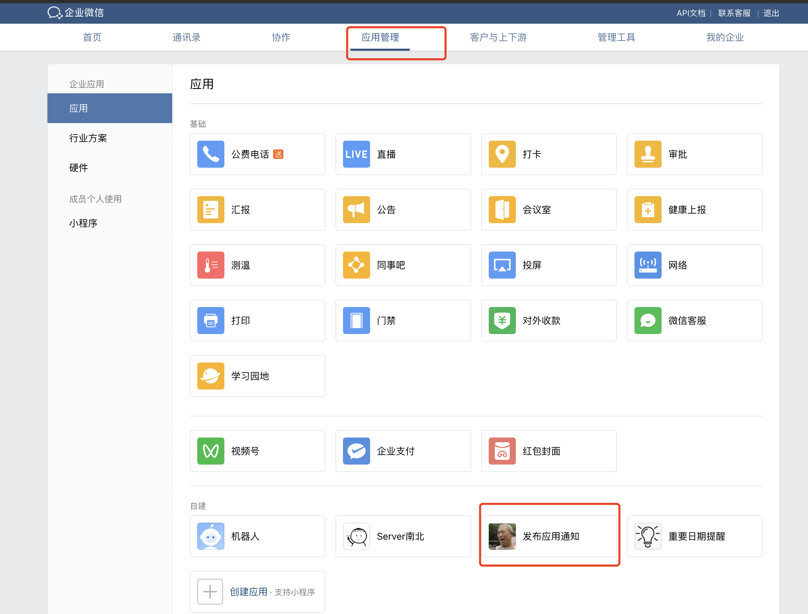
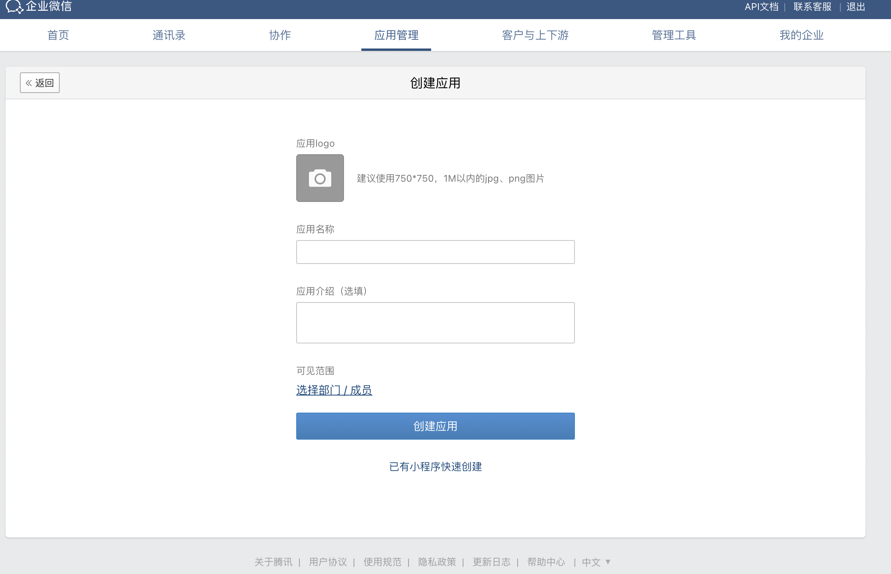
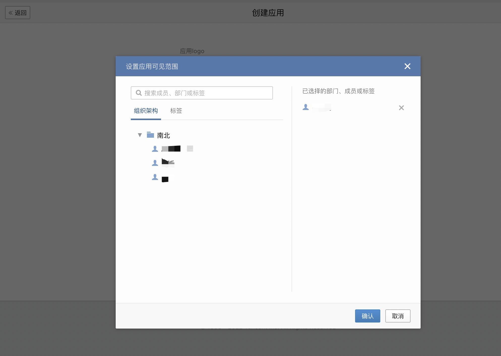
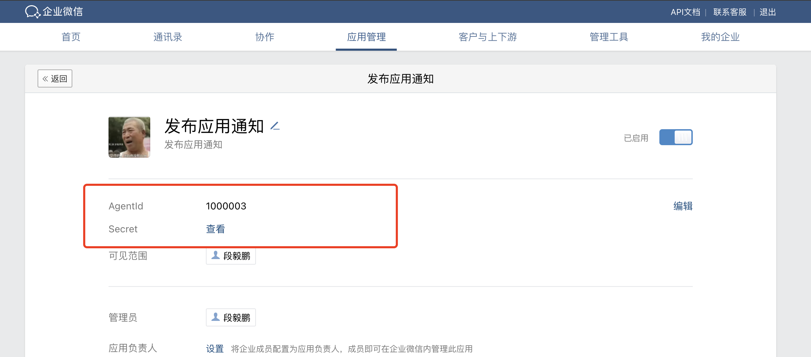
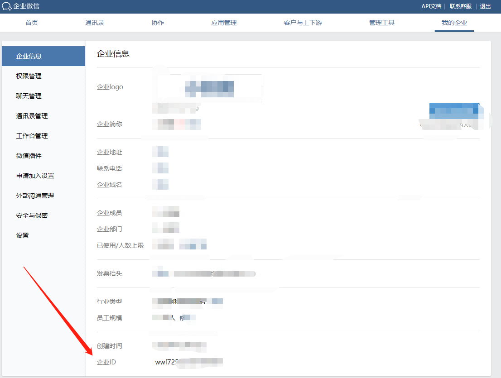
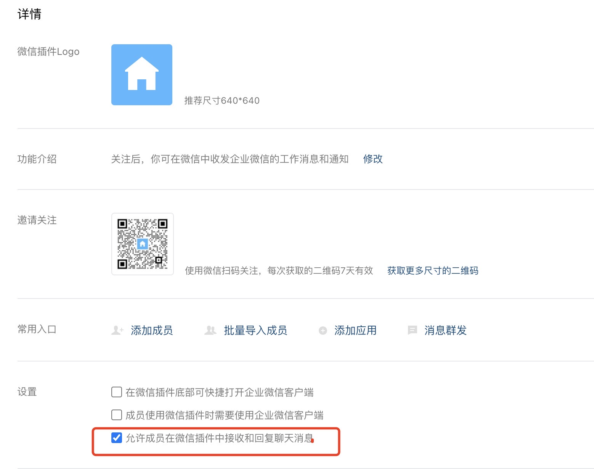
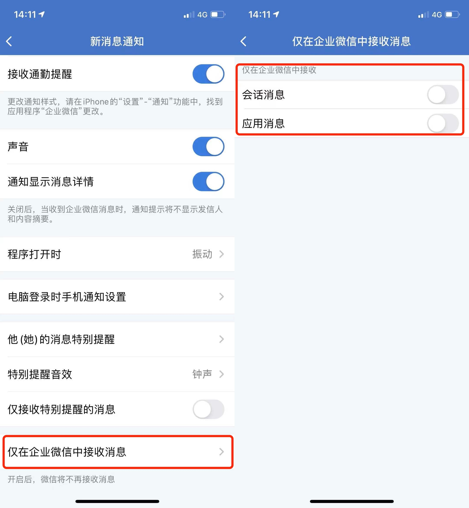

### 需要的变量

```txt
WX_COMPANY_ID= 企业ID
WX_APP_ID= 应用ID
WX_APP_SECRET= 应用 Secret

TIAN_API_KEY= 天行数据 key
```

<details><summary>点击查看企业微信的注册步骤的详细示例</summary>

#### 第一步，注册企业

用电脑打开[企业微信官网](https://work.weixin.qq.com/)，注册一个企业。有手机号就可以注册，不用营业执照！不用营业执照！不用营业执照！

#### 第二步，创建应用

注册成功后，点「管理企业」进入管理界面，选择「应用管理」 → 「自建」 → 「创建应用」



应用名称随意填，可见范围选择公司名（或指定组织、个人，建议选择全部，然后在代码里指定用户）。



指定成员或组织



创建完成后进入应用详情页，可以得到应用 ID( agentid )①，应用 Secret( secret )②。



#### 第三步，获取企业 ID

进入「[我的企业](https://work.weixin.qq.com/wework_admin/frame#profile)」页面，拉到最下边，可以得到企业 ID③。



#### 第四步，推送消息到微信

进入「我的企业」 → 「[微信插件](https://work.weixin.qq.com/wework_admin/frame#profile/wxPlugin)」，拉到下边扫描二维码，关注以后即可收到推送的消息。


#### 无法接收到消息的异常情况处理

PS：如果出现`接口请求正常，企业微信接受消息正常，个人微信无法收到消息`的情况：

1. 进入「我的企业」 → 「微信插件」，拉到最下方，勾选 “允许成员在微信插件中接收和回复聊天消息”

    

2. 在企业微信客户端 「我」 → 「设置」 → 「新消息通知」中关闭 “仅在企业微信中接受消息” 限制条件

    

</details>